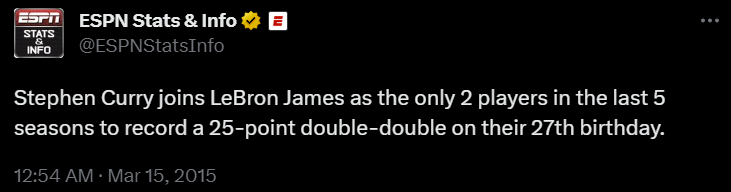

# Oddly Specific NBA Stat Generator

  

This project is inspired by many overly specific basketball stats published by sports media.

---

# What the Application Does:

- Randomly selects an impressive stat from a database of NBA stats.

- Finds better or matching stats and creates a new stat with this information.

---

# Developpement Process

- Flask backend deployed on Heroku.

- React typescript frontend hosted on Netlify.

- NBA stat database hosted on Supabase.

---

# Demo
